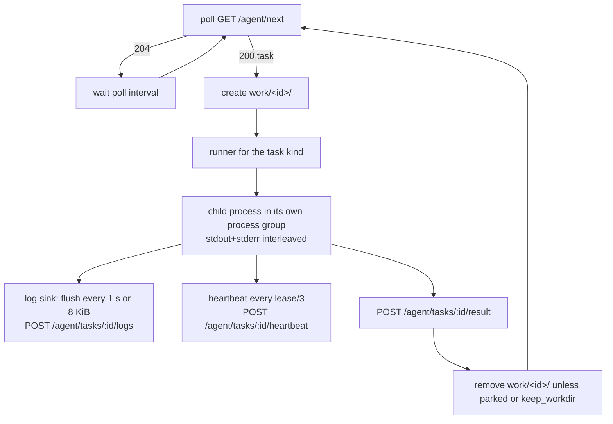
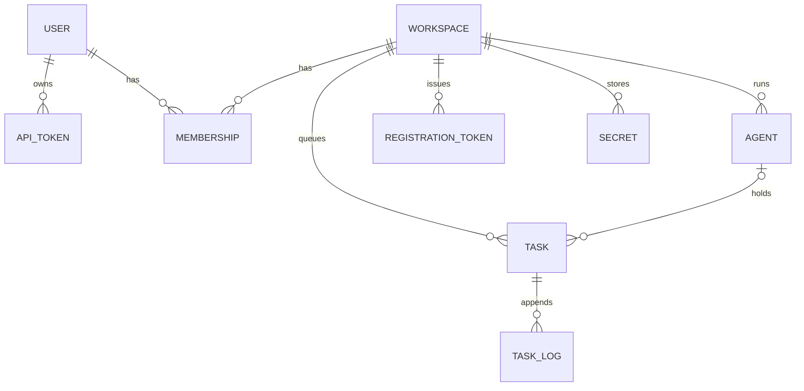

# Architecture

Goran has two processes and one shared protocol.

| Part | Source | Responsibility |
| --- | --- | --- |
| `goran-server` | `webapp/` | HTTP API and console, SQLite database, task queue and leases, secrets, approvals, background reaper |
| `goran-agent` | `agent/` | polls one server with one key, runs one task at a time, streams its log, reports the result |
| wire types | `wire/` | the JSON documents both binaries exchange, defined once and imported by both |

## Server

The server is a single Go binary built on Gin and GORM with a pure-Go SQLite driver. It owns:

- **Routing and authentication.** `/api/...` routes authenticate a user token, `/agent/...` routes authenticate an agent key, `POST /agent/register` is open and consumes a registration token, `GET /` serves the embedded console and `GET /healthz` answers `{"ok": true}`.
- **The database.** One SQLite file in WAL mode with a busy timeout of five seconds and a connection pool limited to one connection, which matches SQLite's single-writer model. The schema is migrated automatically on start.
- **Queue semantics.** Claiming, leasing, requeueing and every status change are guarded `UPDATE` statements, so concurrent agents and operators cannot corrupt a task's state. See [Task lifecycle](task-lifecycle.md).
- **Secrets.** Values are sealed with AES-256-GCM under the master key before they touch the database, and are opened only when a task is handed to an agent.
- **The reaper.** A goroutine runs every half lease and returns tasks with expired leases to the queue, so the console reflects a dead agent even when no other agent is polling.

The server keeps no state outside the database file. Back up the file and the master key and you have backed up everything.

## Agent

The agent is a loop around one HTTP client:

Its packages map to those boxes: `config` (file, environment and flags), `client` (typed HTTP calls and the two sentinel errors `ErrLeaseLost` and `ErrUnauthorized`), `worker` (the loop, leases, result mapping), `runner` (one implementation per task kind plus the shared `Source` logic), `process` (one child process with interleaved output and process-group kill) and `logsink` (buffered, retrying log shipping). Details are in [Execution model](../agent/execution.md).

The agent keeps no state except its config file and the work directory. The work directory matters for one thing: a Terraform plan waiting for approval lives there, which is why the apply phase is routed back to the agent that planned.

## Data model

| Table | Key columns | Notes |
| --- | --- | --- |
| `users` | `name` (unique), `email`, `admin` | no passwords; users authenticate with tokens only |
| `api_tokens` | `user_id`, `name`, `prefix`, `hash` (unique), `last_used_at` | the plaintext token is never stored |
| `workspaces` | `name` (unique) | tenancy boundary |
| `memberships` | `workspace_id` + `user_id` (unique), `role` | `admin` or `member` |
| `registration_tokens` | `workspace_id`, `hash`, `expires_at`, `used_at`, `agent_id` | single use |
| `agents` | `workspace_id`, `name`, `labels`, `key_prefix`, `key_hash` (unique), `last_seen_at` | labels stored as a sorted comma-separated list |
| `secrets` | `workspace_id` + `name` (unique), `ciphertext` | nonce prepended to the AES-GCM ciphertext |
| `tasks` | `workspace_id`, `status`, `agent_id`, `lease_expires_at`, `attempts`, … | the full column list is in the [API reference](../api/tasks.md#the-task-object) |
| `task_logs` | `task_id`, `chunk`, `created_at` | output is appended in chunks and concatenated on read |

Nothing is soft-deleted. Deleting an agent or a secret is immediate.

## Request flow

A user request to `/api/workspaces/client-a/tasks` passes through four steps: the `Authorization` header is hashed and looked up in `api_tokens`; the token's user is loaded and `last_used_at` updated; `client-a` is resolved by name (or numeric id) and the user's membership is loaded, with global admins given an implicit admin membership; the handler's role requirement is checked. A workspace the caller is not a member of answers `404`, the same as a workspace that does not exist.

An agent request passes through two steps: the key is hashed and looked up in `agents`, and `last_seen_at` is updated. Task endpoints then check that the task is assigned to this agent and still `pending` or `running`; anything else is a `409` that tells the agent its lease is gone.

## Design choices and their consequences

- **Pull, not push.** Agents need outbound access to the server and nothing else. The price is latency: a new task waits up to one poll interval (default two seconds) before it starts.
- **One task per agent at a time.** Concurrency equals the number of agents in a workspace. Run several agents on one host if you need parallel runs.
- **One server, one SQLite file.** Simple to run and back up. It is sized for tens of agents polling every few seconds, not for thousands. There is no horizontal scaling of the server.
- **Secrets as environment variables.** This is what Terraform providers and most CLIs expect. It also means any process the task starts can read them, and so can anyone who can inspect the agent user's processes.
- **The approval is a server-side state, the plan is an agent-side file.** Approval cannot be bypassed from the agent, and the plan that gets applied is byte-for-byte the plan that was shown. If the agent loses the file, the task is planned again rather than applied blind.
