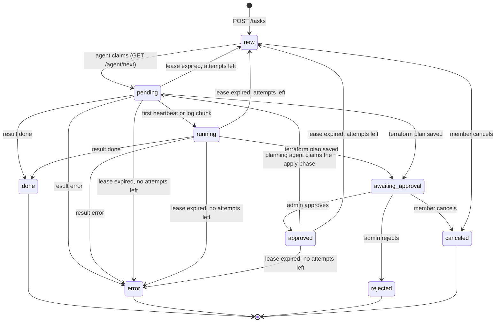
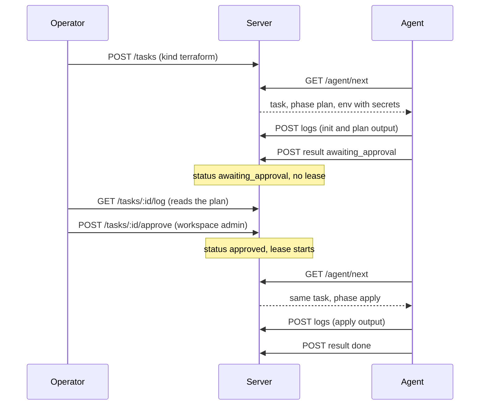

# Task lifecycle

A task is a row in the server's database that moves through a fixed set of statuses. Agents move it forward by claiming it and reporting results; operators move it by approving, rejecting or canceling; the server moves it when a lease expires.

## Statuses

| Status | Meaning | Holds a lease | Terminal |
| --- | --- | --- | --- |
| `new` | queued, waiting for an agent that satisfies its labels | no | no |
| `pending` | claimed by an agent that has not yet sent a heartbeat or log | yes | no |
| `running` | the agent has sent at least one heartbeat or log chunk | yes | no |
| `awaiting_approval` | a Terraform plan was saved and waits for a workspace admin | no | no |
| `approved` | an admin approved; waiting for the planning agent to pick up the apply | yes | no |
| `done` | finished with exit code `0` | no | yes |
| `error` | failed: non-zero exit, runner error, timeout, missing secret, or lease exhausted | no | yes |
| `rejected` | an admin rejected the plan | no | yes |
| `canceled` | withdrawn by a member while `new` or `awaiting_approval` | no | yes |

Each task also carries a **phase** while an agent works on it: `run` for shell and Ansible tasks, `plan` for the first pass of a Terraform task and `apply` for the pass after approval. The phase is empty while the task is `new`.

## State diagram

## Claiming

`GET /agent/next` is the only way a task leaves `new`. On every call the server:

1. Requeues any task in the agent's workspace, or elsewhere, whose lease has expired (see below).
2. Looks for an `approved` task assigned to this agent. If there is one, it is handed back as `pending` in the `apply` phase with a fresh lease. This does not count as a new attempt.
3. Otherwise walks the fifty oldest `new` tasks in the agent's workspace in creation order and picks the first whose required labels the agent carries. The claim is an `UPDATE … WHERE id = ? AND status = 'new'`; if another agent won the race the server moves on to the next candidate.
4. Sets `status = pending`, `phase`, `agent_id`, `lease_expires_at = now + lease`, `attempts = attempts + 1` and, the first time, `started_at`.
5. Decrypts the secrets the task references into the payload. If a secret is missing or cannot be decrypted, the task is set to `error` right away instead of bouncing between agents, and the agent receives `204`.
6. Answers `200` with the task, or `204` when nothing is claimable.

Tasks are served oldest first within a workspace. There are no priorities.

## Leases and heartbeats

Every task in `pending`, `running` or `approved` has a `lease_expires_at`. The lease length is the server's `GORAN_LEASE_SECONDS` (default 60) and is sent to the agent with the task as `lease_seconds`.

- The agent sends a heartbeat every third of the lease, and every log upload also extends the lease. The first of either moves the task from `pending` to `running`.
- Expired leases are detected by the reaper goroutine (every half lease) and additionally on every `GET /agent/next`, `GET …/tasks` and `GET …/tasks/:id`, so what you see in the console is current.
- When a lease expires and `attempts < max_attempts`, the task goes back to `new` with `agent_id`, `phase` and the lease cleared. `attempts` is kept, so the next claim counts as attempt two, three, and so on.
- When a lease expires and the attempts are used up, the task ends as `error` with the message `lease expired after N attempt(s); the agent stopped reporting`.
- An agent that is merely slow or partitioned, not dead, finds out on its next heartbeat, log upload or result: the server answers `409`, the agent kills the task's process group and discards its result. Two agents never run the same task to completion.

`max_attempts` defaults to the server's `GORAN_MAX_ATTEMPTS` (default 3) and can be set per task.

!!! note "Attempts are about lost agents, not failed scripts"
    A task whose script exits non-zero ends as `error` immediately. Goran does not retry failures; it only re-hands out work whose agent stopped reporting. Queue a new task to try again.

## Timeouts

`timeout_seconds` (default: the server's `GORAN_TASK_TIMEOUT_SECONDS`, 3600) is enforced by the agent. When it elapses the agent kills the whole process group and reports `error` with `timed out after 1h0m0s` (Go's duration format). Timeouts and leases are independent: a long-running task stays leased through heartbeats for as long as it takes, up to its timeout.

## The approval cycle

Terraform tasks without `auto_approve` run in two passes on the same agent.

- The plan pass ends with the result `awaiting_approval`. The task has no lease while it waits; it can wait for days.
- Approval sets `approved`, records `approved_by_id` and starts a lease. The planning agent gets the task back on its next poll, usually within the poll interval.
- If the planning agent is offline and the lease expires, the task returns to `new` and is planned again from scratch by any eligible agent. The approval does not carry over: nothing is applied that an admin has not seen.
- If the agent is online but lost its work directory (restart with a different `--workdir`, cleaned disk), the apply fails with `no saved plan in …; re-run the task`.
- Reject ends the task as `rejected`. Cancel while `awaiting_approval` ends it as `canceled`. Both are terminal.

## Results

The agent reports exactly one of three results:

| Result | Sets | When |
| --- | --- | --- |
| `done` | `status = done`, `exit_code = 0`, `finished_at` | the process exited `0` |
| `error` | `status = error`, `error` text, `exit_code` when a process ran, `finished_at` | non-zero exit (`exit status 7`), runner error (`git clone exited with status 128`, `exec: "terraform": executable file not found in $PATH`), timeout, or agent shutdown (`agent shut down while the task was running`) |
| `awaiting_approval` | `status = awaiting_approval`, lease cleared | the plan pass of a Terraform task finished without `auto_approve` |

The agent retries the result call three times, two seconds apart, so a short network blip does not turn a finished task into a lease-expiry retry.

## Cancellation

`POST …/tasks/:id/cancel` works on `new` and `awaiting_approval` tasks only and needs the `member` role. There is no way to stop a `running` task from the server in this version; the task ends when the script ends, when its timeout fires, or when the agent is stopped (which reports `error`).

## Concurrency guarantees

Every transition is a guarded update that names the status it expects to find, and the reaper additionally matches the exact lease timestamp it read. The practical effects:

- Two agents polling at the same time cannot claim the same task.
- Two admins approving the same plan: the second gets `409 task is pending, expected awaiting_approval`.
- A result arriving after the lease was given to another agent is refused with `409`.
- A stale console that shows a `new` task which has since been claimed cannot cancel it.
