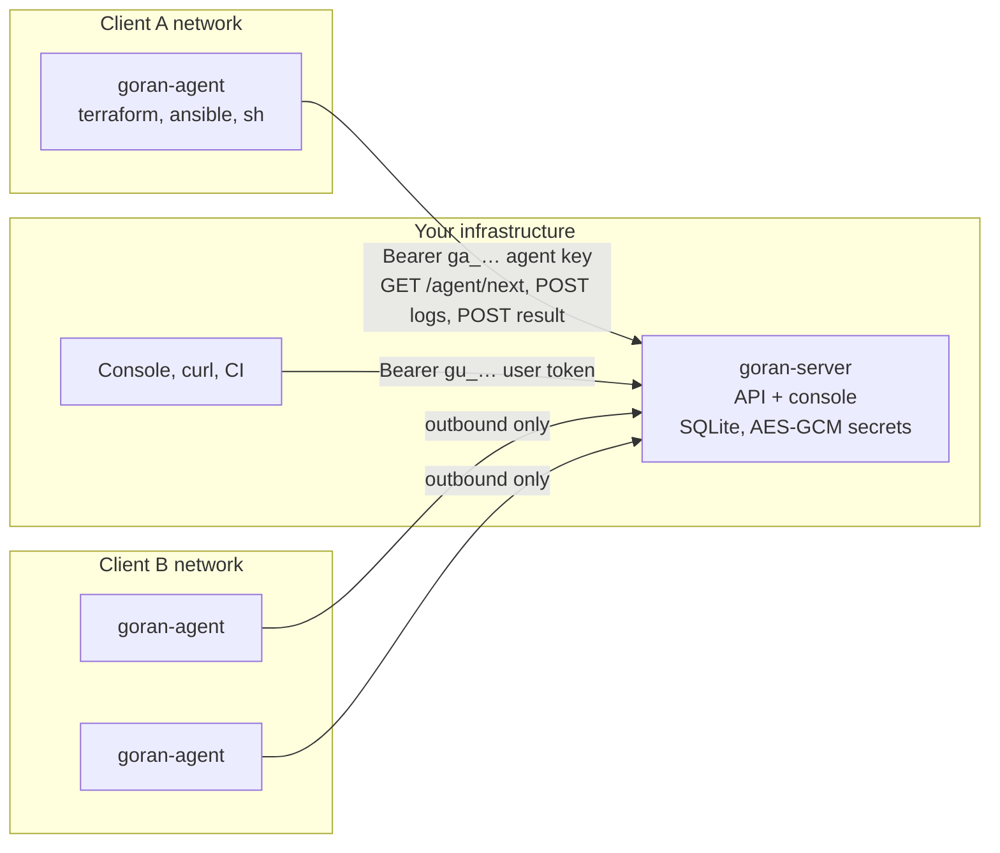

# Goran

Goran is a small, self-hosted job runner for infrastructure work. A central **server** holds the queue, the secrets and the approval state. Lightweight **agents** inside each client's network poll the server for work and run Terraform, Ansible or shell tasks where the infrastructure lives. Agents only ever make outbound HTTP(S) calls, so nothing has to be opened in a client's firewall.

It is built for agencies, managed service providers and small platform teams that operate infrastructure for several customers and want what Spacelift private workers or Terraform Cloud agents offer, as two static Go binaries and one SQLite file that you run yourself.

## What you get

- **Pull-based agents.** Agents dial out, claim one task at a time, stream the log back and report a result. They work behind NAT, proxies and strict egress rules.
- **Workspaces as the tenancy boundary.** Every client or environment gets a workspace with its own agents, secrets, tasks and members. Agents only see their own workspace's queue.
- **Secrets encrypted at rest.** Values are sealed with AES-256-GCM under a master key you hold. No user-facing endpoint ever returns a value; a secret is decrypted exactly once, into the environment of the agent that just claimed a task.
- **Plan, approve, apply.** Terraform tasks stop after `terraform plan`. A workspace admin reads the plan in the console and approves it, and the same agent applies the saved plan file. Nothing else is planned in between.
- **Three task kinds.** `shell`, `terraform` and `ansible`, with sources taken from a git repository or a directory already on the agent host.
- **Leases, heartbeats and retries.** A task held by an agent carries a lease. If the agent disappears, the server hands the task to another agent, up to a configurable number of attempts.
- **Individually identified agents.** Agents join with single-use, expiring registration tokens and get their own key. Revoking an agent invalidates its key immediately.
- **A console.** The server embeds a single-page web console for tasks, logs, approvals, agents, secrets and members. Everything it does is also available through the JSON API.

## How it fits together

A typical run looks like this:

1. An operator stores the client's cloud credentials as workspace secrets and queues a task that references them by name.
2. An agent in that client's network polls, claims the task, receives the decrypted secrets as environment variables and runs `terraform init` and `terraform plan`.
3. The output streams to the server while the task runs. The task parks as `awaiting_approval`.
4. A workspace admin reads the plan and approves it. The same agent picks the task up again and applies the saved plan.
5. The task ends as `done` with the full log kept on the server.

## Where to go next

| I want to… | Read |
| --- | --- |
| see it run in five minutes | [Quick start](getting-started/quickstart.md) |
| run my first plan/approve/apply cycle | [First Terraform task](getting-started/first-terraform-task.md) |
| understand how work moves through the system | [Task lifecycle](concepts/task-lifecycle.md) |
| know what the server protects and what it does not | [Security model](concepts/security.md) |
| write a task for my use case | [Task anatomy](tasks/index.md), [Shell](tasks/shell.md), [Terraform](tasks/terraform.md), [Ansible](tasks/ansible.md) |
| put the server and agents into production | [Server deployment](server/deployment.md), [Agent deployment](agent/deployment.md) |
| script against the API | [API overview](api/index.md) |
| know what is missing today | [Known limitations](operations/limitations.md) |

## Project status

Goran is an early MVP. The core loop (claim, lease, stream, approve, apply) is implemented and covered by unit, API and end-to-end tests, but the project has not had a public release yet and several conveniences are missing. The [known limitations](operations/limitations.md) page is kept honest; read it before you rely on Goran for anything important.
